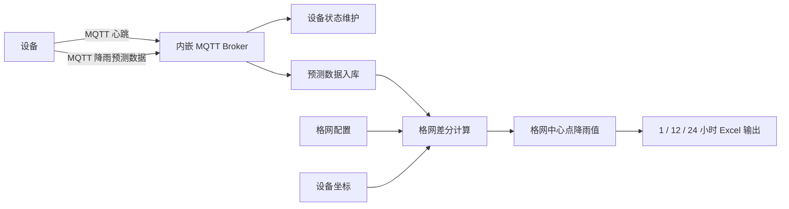

# 降雨格网系统后端

`nav-rain-grid-go` 是降雨格网系统的 Go 后端服务，负责设备管理、MQTT 数据接入、降雨预测数据入库、格网配置管理、定时任务调度以及预测数据导出。

系统核心目标是：**根据设备上报的降雨预测值，对配置好的格网进行空间差分计算，求出每个格网中心坐标的预测降雨值，并按小时输出 1 小时、12 小时、24 小时格网降雨数据到 Excel。**

## 核心能力

- 内嵌 MQTT Broker，默认监听 `1883` 端口
- 接收设备心跳，自动维护设备在线/离线状态
- 接收设备降雨预测数据，写入预测数据表
- 维护设备、格网、预测数据等基础业务数据
- 每分钟检测设备心跳，超过 10 分钟未上报则置为离线
- 支持预测数据查询与 Excel 导出
- 内置静态前端资源，可随后端一起部署

## 核心业务流程



### 1. 设备心跳

设备通过 MQTT 上报心跳，消息中携带 `sncode`。后端收到后会：

- 根据 `sncode` 创建或更新设备记录
- 设置设备状态为在线
- 更新 `last_time` 为当前时间

如果设备超过 10 分钟没有心跳，定时任务会将其设置为离线。

### 2. 降雨预测入库

设备通过 MQTT 上报一天内的预测降雨数据，当前支持 `1`、`12`、`24` 小时预测值。后端会解析并写入 `Predict` 数据。

示例：

```json
{
  "sncode": "DEV001",
  "baseTime": 1717200000000,
  "rain1h": 0.1,
  "rain12h": 1.2,
  "rain24h": 2.4
}
```

也支持数组形式：

```json
{
  "snCode": "DEV001",
  "time": 1717200000,
  "data": [
    { "hour": 1, "rain": 0.2 },
    { "hour": 12, "rainfall": 1.3 },
    { "hour": 24, "predictRain": 2.5 }
  ]
}
```

### 3. 格网差分计算

格网模块用于维护格网计算参数，包括：

- 格网名称
- 参与计算的设备 `sncode` 列表
- 格网分辨率，单位为度，默认 `0.01`（约 1 公里），`0.02` 表示约 2 公里
- 最少参与设备数
- 站点影响距离 `minDistance`，单位公里，默认 `5`
- 启用/禁用状态

系统按小时读取预测数据，并基于设备坐标和预测降雨值进行 IDW 格网差分，计算每个格网中心坐标上的降雨值。

输出目标：

- 每小时执行一次
- 分别计算 `1 小时`、`12 小时`、`24 小时`预测降雨
- 输出格网中心坐标及预测降雨值到 Excel

Excel 建议字段：

| 字段 | 说明 |
| --- | --- |
| gridName | 格网名称 |
| centerLng | 格网中心经度 |
| centerLat | 格网中心纬度 |
| forecastHour | 预测时长，取值 1 / 12 / 24 |
| predictRain | 预测降雨值 |
| predictRainLevel | 预测降雨等级 |
| baseTime | 预测基准时间 |
| time | 预测时间 |

## 技术栈

- Go
- Gin
- GORM
- SQLite
- Mochi MQTT
- robfig/cron
- Excelize
- Zap

## 目录结构

```text
nav-rain-grid-go
├── apis          # HTTP 接口
├── configs       # 项目配置结构
├── domains       # 数据模型
├── inits         # 系统初始化入口
├── mqtt          # MQTT Broker 与消息处理
├── routers       # 路由注册
├── scheduleds    # 定时任务
├── services      # 业务服务
├── webs          # 内置前端静态资源
├── config.yaml   # 默认配置
└── main.go       # 程序入口
```

## 配置说明

默认配置文件为 `config.yaml`。

```yaml
system:
  app-name: "nav-rain-grid"
  addr: 18889
  db-type: sqlite
  router-prefix: /api

sqlite:
  db-name: nav-rain-grid
  path: ./data/

mqtt:
  enable: true
  host: ""
  port: 1883

rain:
  version-path: ./data/version
```

说明：

- HTTP 服务默认端口：`18889`
- API 前缀：`/api`
- MQTT 服务默认端口：`1883`
- SQLite 数据目录：`./data/`
- 版本发布文件目录：`./data/version`

## 运行

```bash
go mod tidy
go run main.go
```

启动后：

- 后端地址：`http://127.0.0.1:18889`
- API 地址：`http://127.0.0.1:18889/api`
- Swagger 地址：`http://127.0.0.1:18889/api/swagger/index.html`
- MQTT Broker：`127.0.0.1:1883`

## 构建

```bash
make all
```

清理构建产物：

```bash
make clean
```

## 远程安装

`deploy/install-server.sh` 可在 Linux systemd 主机上一键安装或升级服务。脚本会根据目标机器架构拉取版本发布中的安装包，默认安装到 `/opt/nav-rain-grid`，服务名为 `nav-rain-grid`。首次安装和重复执行升级使用同一条命令，不需要 token。

通过版本发布接口安装最新版本：

```bash
curl -fsSL https://example.com/install-server.sh | sudo sh -s -- \
  --api-base https://example.com/api
```

直接指定二进制下载地址：

```bash
curl -fsSL https://example.com/install-server.sh | sudo sh -s -- \
  --download-url https://example.com/api/version-release/GUID/download
```

## 主要接口

### 设备

```text
POST   /api/device
PUT    /api/device/:guid
DELETE /api/device/:guid
GET    /api/device/:guid
GET    /api/device/sncode/:sncode
GET    /api/device/list
GET    /api/device/query
```

### 格网

```text
POST   /api/grid
PUT    /api/grid/:guid
DELETE /api/grid/:guid
GET    /api/grid/:guid
GET    /api/grid/list
GET    /api/grid/query
```

### 预测数据

```text
DELETE /api/predict/params
DELETE /api/predict/:guid
GET    /api/predict/:guid
GET    /api/predict/list
GET    /api/predict/query
GET    /api/predict/last
GET    /api/predict/export
```

### 版本发布

```text
POST   /api/version-release
PUT    /api/version-release/:guid
POST   /api/version-release/upload
POST   /api/version-release/:guid/upload
DELETE /api/version-release/:guid
GET    /api/version-release/latest
GET    /api/version-release/:guid/download
GET    /api/version-release/:guid
GET    /api/version-release/list
GET    /api/version-release/query
```

## MQTT 数据约定

### 心跳消息

支持 JSON、键值、纯文本等形式：

```json
{ "sncode": "DEV001" }
```

```text
sncode=DEV001
```

```text
DEV001
```

### 预测消息

字段命名兼容多种形式：

- `sncode` / `snCode` / `sn_code`
- `baseTime` / `base_time` / `time` / `timestamp`
- `rain1h` / `rain12h` / `rain24h`
- `predictRain1H` / `predictRain12H` / `predictRain24H`
- `data[].hour + data[].rain`

## 定时任务

| 任务 | 周期 | 说明 |
| --- | --- | --- |
| DeviceStatusCheck | 每 1 分钟 | 超过 10 分钟无心跳的在线设备设置为离线 |
| 格网降雨计算 | 每 1 小时 | 基于预测降雨和格网配置计算中心点降雨值，并输出 1 / 12 / 24 小时 Excel |

## 数据模型

### Device

设备基础信息，包含设备号、坐标、设备类型、在线状态、最后心跳时间等。

### Predict

设备预测降雨数据，按 `sncode + baseTime + time` 维护预测记录。

### Grid

格网配置，包含设备集合、分辨率、最少设备数、站点影响距离和状态等。分辨率使用 `float64` 度数，默认 `0.01`（约 1 公里），`0.02` 表示约 2 公里；`minDistance` 使用公里，默认 `5`。

### VersionRelease

版本发布记录，包含版本号、应用名称、平台、架构、发布说明、版本文件路径、文件名、文件大小、SHA256 校验值、发布状态和发布时间。上传文件保存到 `rain.version-path` 配置目录。

## 开发约定

- 新业务表需要在 `domains.RegisterTables()` 中注册
- HTTP 接口放在 `apis`
- 路由放在 `routers`
- 业务逻辑放在 `services`
- MQTT 消息处理放在 `mqtt`
- 定时任务放在 `scheduleds`

## 测试

```bash
go test ./...
```
